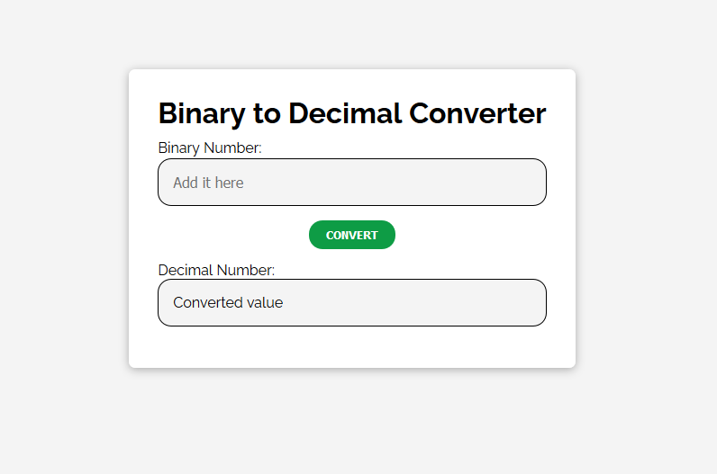

I was really proud that I was able to write this simple script. It's something that I made without following a tutorial.

I saw a binary to decimal converter as a suggestion for a beginner-level project and it sent me on a search on how I can do it. That's when I got the idea of using [`parseInt()`](https://developer.mozilla.org/en-US/docs/Web/JavaScript/Reference/Global_Objects/parseInt). This built-in function takes 2 parameters. One is a string argument and the other is radix, and it outputs an integer. If the radix is 8, the function converts an octal number to decimal. So, if I set the radix to 2, it converts a binary number to decimal.

With HTML and CSS, I created a box. I then added a title, an input field, a button and an output field. I styled them which actually took more time than I expected. I did the styling after I wrote the script.

The script is simple. It uses `const`, `querySelector`, `addEventListener`, `textContent`, etc. When the user clicks on the button, the event handler function goes off. The handler takes the input value, parses it and converts it into a decimal, and prints it out on the output field.

It was challenging for a beginner like me and at the same time fun and engrossing to make this converter.

You can check the code in [this repo](https://github.com/nslcoder/binarytodecimalconverter).
