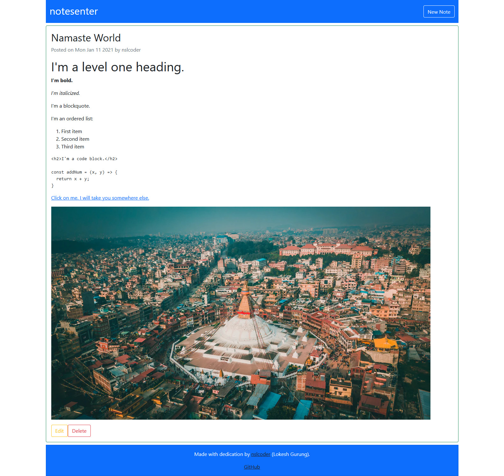

[](https://notesenter.herokuapp.com/)

In my previous post, I detailed how I created a RESTful CRUD API. Taking the learnings I did while building that API, I made [a simple Markdown note-taking app](https://notesenter.herokuapp.com/). The app allows you to create a new note; use Markdown syntax to write, post a link, add an image or do anything Markdown is capable of; and save it. It only has a basic set of functionalities for now, but in the future, I'll add authentication & authorization, increase the limit of notes a user can create, implement pagination and execute other ideas that I might have. 

## What I Learned

- How to render the frontend in the server and send it to the browser (I used EJS and Bootstrap to build the view)
- How to configure the server to connect with MongoDB Atlas via Mongoose
- How to convert Markdown to HTML with Marked and sanitize HTML with DOMPurify and jsdom
- How to use pre hook validation 
- How to work around pre hooks for updates 
- How to use the HTTP methods PUT and DELETE in a HTML form with method-override 
- How to set up a database limit 
- How to deploy to Heroku


## How I Built It 
Unlike in my previous post, I won't explain everything I did to build this app. I will only cover the new things I learned and the challenging parts. 

### Views
Views are the visual part of the app. To create the frontend, I used EJS (Embedded JavaScript) templates with Bootstrap. All the files with `.ejs` extension go into the views folder. In the main file (i.e. `app.js`), I added the following line and started working on the `.ejs` files:

```
app.set("view engine", "ejs");
```

In the head of all the `.ejs` files, I added the following line to use Bootstrap:

```
<link href="https://cdn.jsdelivr.net/npm/bootstrap@5.0.0-beta1/dist/css/bootstrap.min.css" rel="stylesheet" integrity="sha384-giJF6kkoqNQ00vy+HMDP7azOuL0xtbfIcaT9wjKHr8RbDVddVHyTfAAsrekwKmP1" crossorigin="anonymous">
```

**Two things to note:** 

1. With EJS templates, I'm using server-side rendering. It's means the pages are rendered in the server and sent to the client (i.e. the browser) which just displays the pages. This is opposite of client-side rendering, where the pages are rendered in the client after receiving data (such as basic HTML) from the server.
2. The folder from where the views files are served don't have to be specified in the main file if the folder is in the root directory and named `views`.

### Connecting with MongoDB Atlas 
MongoDB Atlas is a cloud database service. It has a free tier that offers 512MB storage which is suitable for small apps. The app can't use the local MongoDB instance in my laptop. It needs a database that can be accessed anytime from the internet, so Atlas is the best choice. I pulled out the connection string from Atlas, inserted my password and the database name in the string, and then added the string in the `.env` file so that the app can use it. 

In the main file, I used Mongoose to make the connection between the app and the database:

```
const dbURL = process.env.MONGODB_URL;

mongoose.connect(dbURL, {
    useNewUrlParser: true,
    useUnifiedTopology: true,
    useFindAndModify: false,
    useCreateIndex: true
})
.then(() => {
    console.log("Database connected.");
})
.catch(err => {
    console.log(err);
});
```

### Markdown and HTML Sanitization 
I used Marked to parse Markdown and convert it into HTML, and then DOMPurify (with jsdom) to sanitize the HTML. Sanitizing HTML prevents cross-site scripting (XSS) attacks. I used these packages at the schema level, which is recommended. I tried to use both packages in the controllers but failed miserably. 

In the `Note.js` file inside the `models` directory, I added the following: 

```
const marked = require("marked");
const createDOMPurify = require("dompurify");
const { JSDOM } = require("jsdom");

const window = new JSDOM("").window;
const DOMPurify = createDOMPurify(window);
```

In the schema, there is a field `sanitizedHTML` which holds sanitized HTML strings converted from Markdown. 

```
sanitizedHTML: {
	type: String,
	required: true
}
```

### Pre Hook Validation
I used the piece of code shown below to validate the document. It takes `description` of the document (here `this` refers to the document). `marked()` turns the Markdown description string into HTML. `DOMPurify.sanitize()` sanitizes the output HTML and creates clean HTML which is then stored in the `sanitizedHTML` field. The validation is done every time a new document is created or when the old one is updated. 

```
NoteSchema.pre("validate", function(next) {
    if(this.description) {
        this.sanitizedHTML = DOMPurify.sanitize(marked(this.description));
    }

    next()
});
```

### Work Around Pre Hooks for Updates
Pre hooks aren't available for any of the update methods such as `update()`, `findByIdAndUpdate()`, etc. They are executed when creating new documents but when old docs are changed using any update method, they don't get executed. So, the trick is to find a document by its id, assign the altered fields to the old fields and save the doc with `save()`. This way pre hook validation gets executed and our app will show the updated note. 

```
const updateNote = async (req, res) => {
    try {
        const note = await Note.findById(req.params.id);
 
        note.title = req.body.title;
        note.description = req.body.description;

        await note.save();
        res.redirect("/");
    } catch(e) {
        console.log(e);
    }
};
```

### PUT and DELETE in a HTML Form with method-override
HTML forms only support two HTTP methods: GET and POST. If we have to put or delete resources from HTML forms, there is no way other than using a third-party package. Fortunately such a package exists: method-override. 

In the `app.js` file, I added these lines:

```
const methodOverride = require("method-override");

app.use(methodOverride("_method"));
``` 

The app needs delete method in the `index.ejs` file only. So, I added this there: 

```
<form action="/notes/<%= note._id %>?_method=DELETE" method="post">
	<button class="btn btn-outline-danger">Delete</button>
</form>
```

And, the app needs put method in the `edit.ejs` file only. So, I added this there:

```
<form action="/notes/<%= note._id %>?_method=PUT" method="post" class="border p-3 m-2 rounded">
        
	// Some HTML and Bootstrap classes come here which you can check in the GitHub repo
		                     
	<div class="btn-group" role="group" aria-lable="buttons">
		<button class="btn btn-outline-danger">Save</button>
		<a href="/" class="btn btn-outline-warning">Cancel</a>
	</div>
</form>
```

**One thing to note:**

1. Use method-override before any module that needs to know the method of the request. 

### Setting the Database Limit
I was worried that someone with malicious intentions could make numerous notes on my app and eat all my free storage at Atlas. So, I decided to set up a limit on how many notes can be created. 

In the `controllers.js` file, I added this line which checks the number of notes in the database before  a note is created. If there are already 5 notes, the app will show a database-limit-reached message instead of creating another note. 

```
if(noteCount.length > 4) return res.render("new", { info: "d-block" });
```

### Deploying to Heroku 
This is the first time I'm deploying to Heroku. Actually this is the first time I'm deploying a website or web app with backend. 

So, at first I pushed the entire source code to a GitHub repo (I did this in bits since the start of working on this app). Then, I chose GitHub as one of the deployment methods at Heroku. But there was an error and it wasn't deployed. It took me some time to figure out and successfully push my app to the internet for others to see. 

**Two things to note:**

1. In the settings tab of your app at the Heroku dashboard, add buildpack. They are needed to install the app's dependencies and configure the environment. This app is made in Node.js and that's what I chose. 
2. While pushing the app's source code to GitHub, I gitignored the `.env` file that has the connection string to Atlas, which should be done so that others can't find out the login credentials of various services you use. But Heroku now has no way of knowing the string. That's when config vars can be used to set up the environment variables. I provided the connection string as config var and my app got deployed successfully. You can also set it up in the settings tab. 

### Concluding Thoughts
I had a great fun and also a challenging time while working on this app. Before this, I had created a CRUD API. Building on top of that, I added the frontend and various other things in the backend to give this app a definite form. And that's what I'm going to do: stand on the things I've already learned and grow from there. 

The app isn't "complete" yet. In the coming days, I will keep on working on it and add features. 

**Todos:**

- [ ] Authentication and authorization
- [ ] Increase the number of notes a user can create
- [ ] Pagination 

You can find the entire code at this [GitHub repo](https://github.com/nslcoder/notesenter).